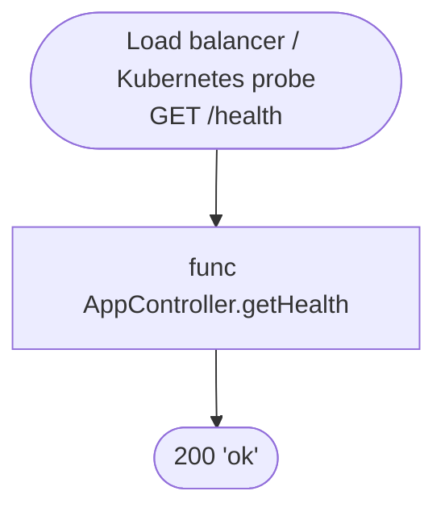
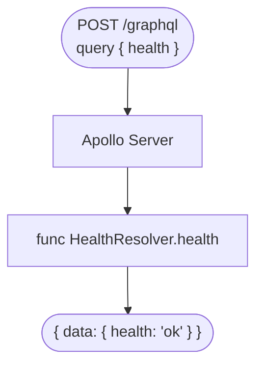

# Các endpoint khác của `lb-api`

Bốn endpoint auth (`login`, `callback`, `me`, `logout`) nằm ở `authentication-flows.md`.
File này mô tả phần còn lại. Code nằm ở `apps/lb-api/src/`.

---

## 1. Health check REST: `GET /health`

Chạy qua:

- `AppController.getHealth` (`app.controller.ts`): trả chuỗi `ok`, không gọi service nào.

Lý do thiết kế:

- Không kiểm tra Postgres/Redis.
  - Lý do: đây là liveness, chỉ trả lời "process còn sống không". Nếu kiểm tra phụ thuộc, DB chậm sẽ khiến Kubernetes restart pod mà không sửa được gì.
- Không có guard, không cần cookie.
  - Lý do: probe hạ tầng không có session.

Debug:

- 404: sai đường dẫn, API không dùng global prefix nên đường dẫn là `/health`, không phải `/api/health`.
- Không phản hồi: process chưa khởi động xong hoặc đã chết, xem log `bootstrap`.

---

## 2. Health check GraphQL: query `health`

Chạy qua:

- `GraphQLModule.forRoot` (`app.module.ts`): dùng `ApolloDriver`, `autoSchemaFile: true`.
- `HealthResolver.health` (`health/health.resolver.ts`): trả chuỗi `ok`.

Lý do thiết kế:

- Có riêng một query `health` ngoài `GET /health`.
  - Lý do: `GET /health` chỉ chứng minh process sống; query này chứng minh Apollo đã dựng được schema và resolver chạy được.
- `autoSchemaFile: true`: schema sinh từ decorator, không có file `.graphql` riêng, và nằm trong bộ nhớ.
  - Lý do: code là nguồn duy nhất, không lệch schema.
- Playground bật khi `APP_ENV` khác `production`.
  - Lý do: tiện thử query khi dev, nhưng không để lộ ở production.

Hiện trạng cần biết:

- GraphQL **chưa có xác thực**: context chưa chứa `currentUser`, và `AuthGuard` chưa gắn vào resolver nào.
  - Hệ quả: khi thêm resolver cần xác thực, phải nối guard và context trước, nếu không `currentUser` luôn trống.

Debug:

- Lỗi lúc khởi động liên quan schema: kiểm tra decorator `@Resolver`, `@Query` và type trả về.
- Không thấy playground: kiểm tra `APP_ENV` có đang là `production` không.

---

## 3. Tài liệu API: `/api/docs`

Chạy qua:

- `bootstrap` (`main.ts`): dựng Swagger từ các decorator trên controller, mount ở `/api/docs`.
- Khai báo cookie auth `lb_session`: để thử các endpoint cần đăng nhập ngay trong giao diện.

Lý do thiết kế:

- Swagger chỉ mô tả REST (các endpoint auth và `/health`), không mô tả GraphQL.
  - Lý do: GraphQL tự có schema và playground.
- Mô tả query/response nằm ngay trên DTO bằng `@ApiProperty`.
  - Lý do: một chỗ duy nhất, đổi DTO thì tài liệu đổi theo.

Debug:

- Thiếu một field trong Swagger: kiểm tra DTO đã có `@ApiProperty` hoặc `@ApiPropertyOptional` chưa.
