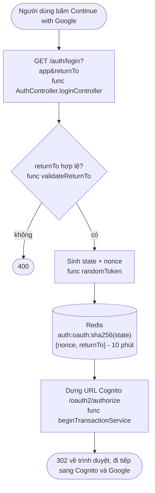
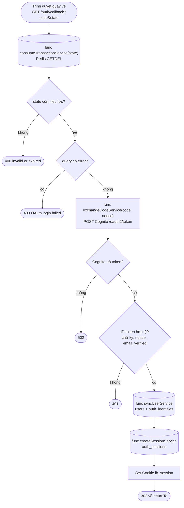
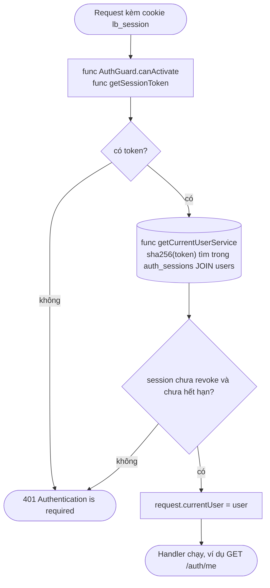
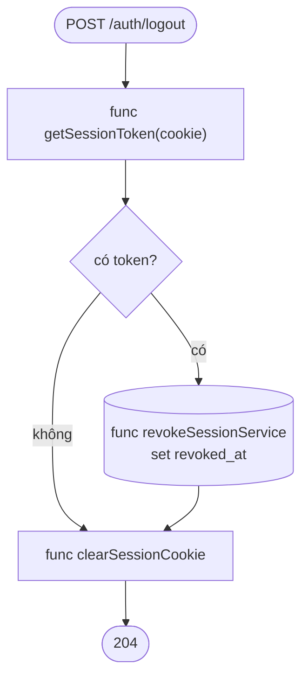

# Auth flows trong `lb-api`

Mô tả flow theo code hiện tại để debug. Cấu hình AWS/Cognito và secret xem
`authentication.md`. Code nằm ở `apps/lb-api/src/auth/`.

## Nguyên tắc chung

- Trình duyệt luôn là trung gian của mọi bước redirect.
  - Lý do: Google cần người dùng tự chọn tài khoản, server không làm thay được.
- Backend chỉ gọi Cognito trực tiếp một lần, ở `callback`, để đổi `code` lấy token.
  - Lý do: việc này cần `client_secret`, chỉ backend giữ được.
- Token Cognito không bao giờ ra frontend; trình duyệt chỉ nhận cookie `lb_session`.
  - Lý do: token nằm trong URL/JS dễ bị lộ, còn cookie `HttpOnly` thì JS không đọc được.

Vị trí code:

- `oauth/`: bắt đầu và kết thúc "giao dịch đăng nhập" (state, nonce, returnTo).
- `cognito/`: nói chuyện với Cognito và đồng bộ user.
- `session/`: session LastBite và cookie.
- `auth.service.ts`: `completeLoginService` điều phối các bước của callback.
- `auth.controller.ts`: bốn endpoint `login`, `callback`, `me`, `logout`.
- `auth.guard.ts`: đọc cookie, gắn user vào request.
- `auth.config.ts`: đọc biến môi trường, báo lỗi ngay lúc khởi động nếu thiếu.
- `auth.crypto.ts`: token ngẫu nhiên, sha256, mã hoá refresh token.
- `dto/`: validate query của `login` và `callback`.
- `common/` (ngoài `auth/`): thứ dùng chung nhiều module, không phụ thuộc ngược vào `auth/`.
  - `decorators/current-user.decorator.ts`: `@CurrentUser()`.
  - `types/`: `AuthenticatedRequest`, `CurrentUserDto`.

---

## 1. Bắt đầu đăng nhập: `GET /auth/login`

Chạy qua:

- `AuthController.loginController` (`auth.controller.ts`): nhận `app`, `returnTo`; `AuthLoginQueryDto` validate đầu vào.
- `AuthService.beginLoginService`: chỉ chuyển tiếp.
- `OAuthTransactionService.beginTransactionService` (`oauth/oauth-transaction.service.ts`):
  - `validateReturnTo`: kiểm tra `returnTo`.
  - `randomToken` (`auth.crypto.ts`): gọi hai lần, sinh `state` và `nonce`.
  - `RedisService.set`: lưu giao dịch với key `stateKey(state)`.
  - Dựng và trả URL Cognito.
- Quay lại `AuthController.loginController`: `response.redirect(authorizeUrl)`.

- Kiểm tra `returnTo` cùng origin với app, không có user/password trong URL.
  - Lý do: nếu không, link đăng nhập của LastBite bị lợi dụng để đưa người dùng sang trang giả (open redirect).
- Sinh `state` và `nonce` ngẫu nhiên, lưu vào Redis cùng `returnTo`.
  - Lý do: giữa lúc đi và lúc về server không nhớ gì, phải lưu lại để đối chiếu.
  - `state` chống request callback giả mạo; `nonce` chống dùng lại ID token cũ.
- Key Redis là hash của `state`, không phải `state` thô.
  - Lý do: lộ Redis cũng không lấy được `state` còn dùng được.
- TTL 10 phút.
  - Lý do: đăng nhập bỏ dở tự biến mất, không để rác.
- Kết thúc bằng `response.redirect`: backend chưa hề gọi Cognito.
  - Lý do: Cognito không có API đăng nhập để gọi, chỉ có thể đẩy trình duyệt sang.

Lỗi hay gặp:

- 400 `returnTo is not allowed for this app`: `returnTo` khác origin với `CUSTOMER_APP_URL`/`MERCHANT_APP_URL`.

---

## 2. Hoàn tất đăng nhập: `GET /auth/callback`

Chạy qua:

- `AuthController.callbackController` (`auth.controller.ts`): nhận `code`, `state`, `error`.
  - `OAuthCallbackQueryDto` validate ở biên: `state` bắt buộc, `code` bắt buộc trừ khi có `error`.
- `AuthService.completeLoginService(code, state, oauthError)` (`auth.service.ts`): điều phối, gọi lần lượt:
  - `OAuthTransactionService.consumeTransactionService` (`oauth/`): gọi `RedisService.getDel`, trả `{ nonce, returnTo }`.
  - Có `oauthError`: ném `BadRequestException` ngay tại đây, không đi tiếp.
  - `CognitoOAuthService.exchangeCodeService` (`cognito/cognito-oauth.service.ts`): gọi `requestTokens` (`fetch` tới Cognito) rồi `verifier.verify`, sau đó kiểm tra `nonce`, `email_verified`.
  - `CognitoUserService.syncUserService` (`cognito/cognito-user.service.ts`): transaction tạo hoặc cập nhật user.
  - `AuthSessionService.createSessionService` (`session/auth-session.service.ts`): gọi `randomToken`, `sha256`, `encryptRefreshToken` (`auth.crypto.ts`), rồi insert `auth_sessions`.
- Quay lại `AuthController.callbackController`: `setSessionCookie` (`session/auth.cookie.ts`), rồi `response.redirect(returnTo)`.

- `consumeTransactionService` dùng `GETDEL`: đọc xong là xoá.
  - Lý do: một `state` chỉ dùng được một lần, chống replay.
  - Hệ quả khi debug: refresh hoặc bấm lại link callback sẽ báo "invalid or expired".
- `state` bị xoá trước khi kiểm tra các bước sau, kể cả khi bước sau lỗi.
  - Lý do: lần đăng nhập lỗi thì phải làm lại từ đầu, không được thử lại với cùng `state`.
- Nhánh `error` vẫn xoá `state` (`consumeTransactionService`) trước khi báo lỗi.
  - Lý do: người dùng từ chối ở Google thì Cognito vẫn trả `state`; xoá nó để dọn sạch giao dịch.
- Thiếu `code` mà không có `error` bị chặn ở DTO (400).
  - Lý do: validate ở biên. Service vẫn nhận `code` là `string | undefined` vì khi có `error` thì `code` vắng; `exchangeCodeService` giữ thêm một lần kiểm tra cho an toàn.
- Verify ID token và đối chiếu `nonce`.
  - Lý do: chứng minh token do Cognito phát hành đúng cho lần đăng nhập này, không phải token cũ bị dùng lại.
- Yêu cầu `email_verified = true`.
  - Lý do: tránh tạo tài khoản bằng email chưa được xác minh.
- `syncUserService` chạy trong một transaction, khoá theo `cognitoSub`.
  - Lý do: hai callback đồng thời của người dùng mới không được tạo hai user.
  - Identity định danh bằng `sub` của Cognito, còn email/tên/avatar chỉ cập nhật theo.
  - Lý do: `sub` không đổi, còn email có thể đổi.
- `auth_identities` tách khỏi `users`.
  - Lý do: một tài khoản dùng được cả customer và merchant app.
- `createSessionService` lưu hash của token, và refresh token Cognito đã mã hoá.
  - Lý do: lộ DB cũng không dùng lại được cookie, và không đọc được refresh token.
- Session sống 7 ngày, cookie `HttpOnly`, `SameSite=Lax`, `Secure` khi production.
  - Lý do: JS không đọc được cookie; `Lax` hạn chế CSRF.

Lỗi hay gặp:

- 400 `OAuth state is invalid or expired`: `state` quá 10 phút, đã dùng, hoặc Redis mất dữ liệu.
- 400 `OAuth login failed: ...`: người dùng từ chối đăng nhập.
- 400 từ validation: callback thiếu `state`, hoặc thiếu cả `code` lẫn `error`.
- 401 `Missing Cognito authorization code`: chỉ xảy ra nếu `code` lọt qua DTO mà vẫn trống.
- 401 `Cognito ID token is invalid`: sai chữ ký/issuer, `nonce` lệch, `email_verified` false, hoặc thiếu email.
- 502 `Cognito token exchange failed`: sai `COGNITO_CLIENT_SECRET`, `COGNITO_REDIRECT_URI` không khớp app client, hoặc `code` đã dùng.

---

## 3. Xác thực mỗi request: `AuthGuard` và `GET /auth/me`

Chạy qua:

- `AuthGuard.canActivate` (`auth.guard.ts`): chạy trước handler.
  - `getSessionToken` (`session/auth.cookie.ts`): tách token khỏi header `cookie`.
  - `AuthService.getCurrentUserService`: chỉ chuyển tiếp.
  - `AuthSessionService.getCurrentUserService` (`session/auth-session.service.ts`): gọi `sha256`, rồi query `auth_sessions` JOIN `users`.
  - Gắn `request.currentUser`, hoặc ném `UnauthorizedException`.
- `AuthController.meController`: nhận user qua `@CurrentUser()` rồi trả lại.
  - `@CurrentUser()` (`common/decorators/current-user.decorator.ts`): đọc `request.currentUser` mà guard đã gắn, ném `UnauthorizedException` nếu thiếu.

- Guard băm token rồi tra Postgres, không gọi Cognito.
  - Lý do: Cognito chỉ dùng lúc đăng nhập; mỗi request gọi Cognito vừa chậm vừa phụ thuộc dịch vụ ngoài.
- Điều kiện hợp lệ: chưa `revoked_at` và chưa quá `expires_at`.
  - Lý do: logout hoặc thu hồi phải có hiệu lực ngay, không đợi token hết hạn.
- `@CurrentUser()` ném 401 khi `request.currentUser` trống, thay vì trả `undefined`.
  - Lý do: route nào quên `@UseGuards(AuthGuard)` sẽ lỗi 401 rõ ràng, không trả 200 với body rỗng một cách im lặng.
- Hiện chưa có cache Redis cho session: mỗi request đọc Postgres.
  - Lý do: giữ đơn giản cho MVP; thêm cache khi cần đo được vấn đề tốc độ.

Lỗi hay gặp:

- 401 `Authentication is required`: không có cookie, session hết hạn (7 ngày) hoặc đã bị revoke.
- Cookie không được gửi: kiểm tra `secure` (chỉ bật khi `APP_ENV=production`), `SameSite`, và frontend phải gọi với `credentials: include`.

---

## 4. Đăng xuất: `POST /auth/logout`

Chạy qua:

- `AuthController.logoutController` (`auth.controller.ts`): không có guard.
  - `getSessionToken` (`session/auth.cookie.ts`): lấy token từ header `cookie`; không có token thì bỏ qua bước revoke.
  - `AuthService.logoutService`: chỉ chuyển tiếp.
  - `AuthSessionService.revokeSessionService` (`session/auth-session.service.ts`): gọi `sha256`, rồi update `revoked_at`.
  - `clearSessionCookie` (`session/auth.cookie.ts`): xoá cookie.
  - `@HttpCode(204)`: trả 204.

- Đánh dấu `revoked_at` trong DB thay vì xoá dòng.
  - Lý do: guard từ chối ngay lập tức, và còn dấu vết để điều tra.
- Xoá cookie ở trình duyệt.
  - Lý do: dọn dẹp phía client; hiệu lực thật nằm ở bước revoke.
- Luôn trả 204, kể cả khi không có cookie hoặc token sai.
  - Lý do: logout idempotent, gọi lại bao nhiêu lần cũng không lỗi, không lộ thông tin session nào tồn tại.
- Không gọi Cognito `/logout`.
  - Hệ quả: phiên Google/Cognito trong trình duyệt vẫn còn; lần đăng nhập sau có thể không hỏi lại tài khoản.
